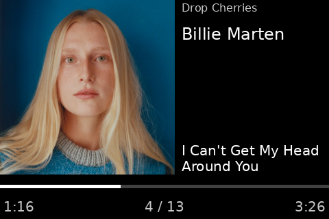

# spotiscreen

Display your Spotify's currently playing song on a low-cost USB smartscreen.

## Prerequisites

- Buy a Turing smart screen on your favorite Chinese e-commerce site
- Create a Spotify app and get a client ID and redirect URI

## Installation

- If you're not using `uv` yet, do yourself a favor and install it
- Clone this repo
- Run `uv run spotiscreen`, or `uv tool install .` to install it for your user

The app needs to open a browser to authenticate with your Spotify account.
If you want to run it headless, first run it on a computer that has a browser
then copy the `~/.config/spotiscreen` directory to your headless deploy.
